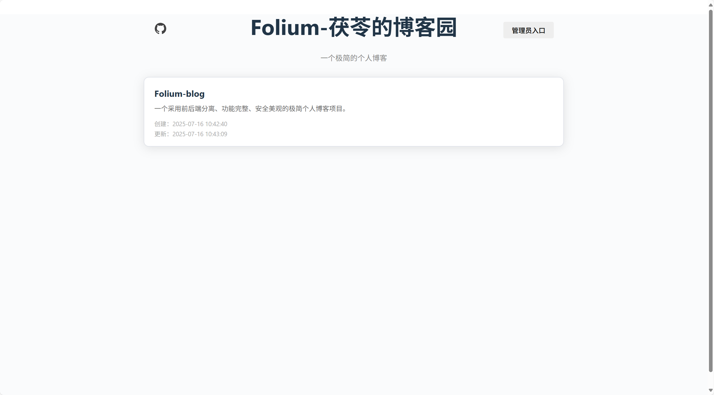
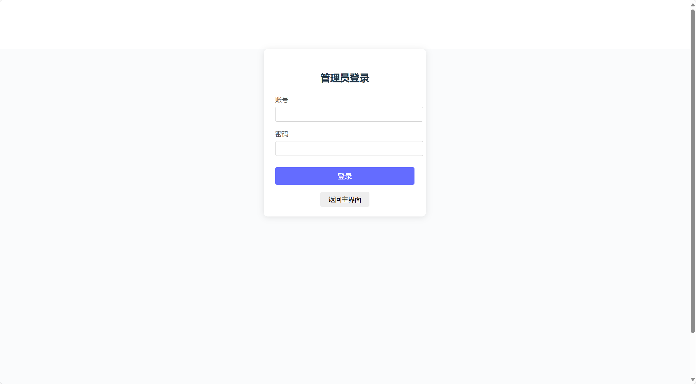
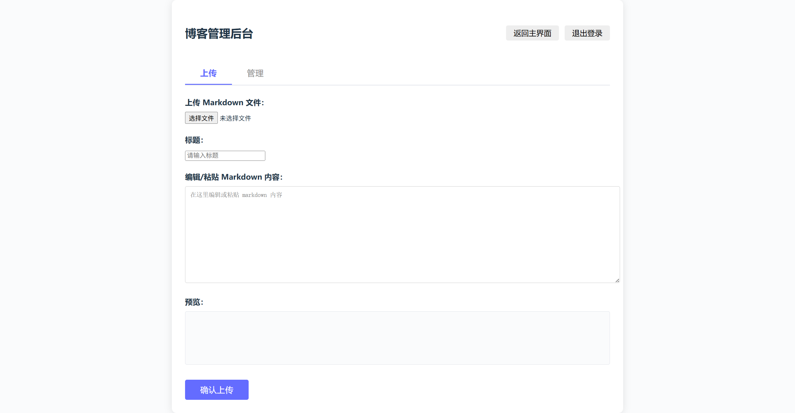
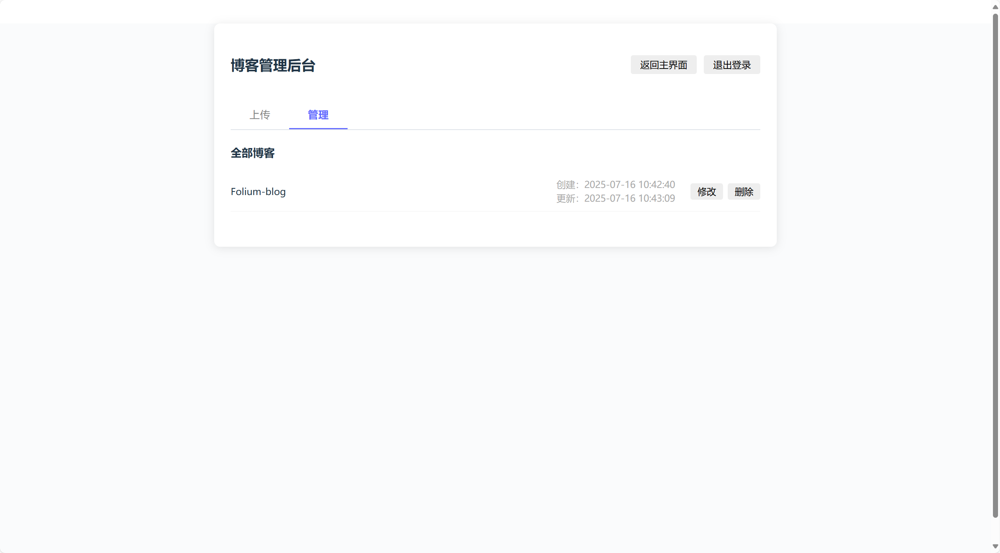
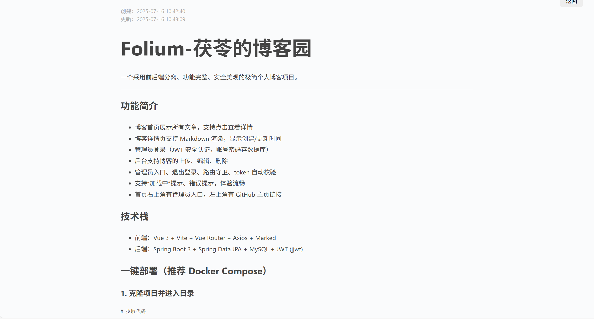

# Folium-茯苓的博客园

<p align="center">
  
</p>

一个采用前后端分离、功能完整、安全美观的极简个人博客项目。

---

## 功能简介
- 博客首页展示所有文章，支持点击查看详情
- 博客详情页支持 Markdown 渲染，显示创建/更新时间
- 管理员登录（JWT 安全认证，账号密码存数据库）
- 后台支持博客的上传、编辑、删除
- 管理员入口、退出登录、路由守卫、token 自动校验
- 支持“加载中”提示、错误提示，体验流畅
- 首页右上角有管理员入口，左上角有 GitHub 主页链接

## 技术栈
- 前端：Vue 3 + Vite + Vue Router + Axios + Marked
- 后端：Spring Boot 3 + Spring Data JPA + MySQL + JWT (jjwt)

## 一键部署（推荐 Docker Compose）

### 1. 克隆项目并进入目录
```bash
# 拉取代码
 git clone https://github.com/你的用户名/Folium-blog.git
 cd Folium-blog
```

### 2. 启动所有服务（首次需耐心等待镜像和依赖下载）
```bash
# 构建并启动前后端和数据库
sudo docker compose up --build -d
```

### 3. 初始化数据库管理员账号
1. 进入数据库容器：
   ```bash
   sudo docker exec -it folium-blog_db_1 mysql -u folium -p
   # 密码 folium
   ```
2. 切换数据库并插入管理员：
   ```sql
   USE folium;
   INSERT INTO admin (username, password) VALUES ('wofiporia', '123456');
   ```
   > 如有其他必填字段，请补全。

### 4. 访问服务
- 前端：http://你的云服务器IP
- 后端：http://你的云服务器IP:8080

### 5. 停止服务
```bash
sudo docker compose down
```

## Docker 镜像加速建议
- 推荐配置阿里云、DaoCloud、腾讯云等国内加速器，否则首次拉取镜像和依赖会很慢。
- Maven 依赖已内置阿里云源。

## 目录结构
```
wofiporia-blog/
  backend/
    blog/
      src/main/java/com/wofiporia/blog/...
      src/main/resources/application.yml
      pom.xml
  frontend/
    src/
      views/
      api/
      router/
      ...
    package.json
    vite.config.js
  README.md
```

## 开发环境
- Node.js 18+
- npm 9+ 或 yarn 1+
- JDK 17+（建议 21）
- Maven 3.8+
- MySQL 8+
- 推荐编辑器：VS Code / IntelliJ IDEA

---

## 项目页面展示







---

## 下一步的计划
- 增加带图片的 Markdown 博客显示功能（支持图片上传与展示）
- 移动端布局适配
